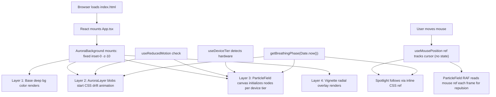

# Aurora Background — Product Requirements Document

## 1. Product Overview

Aurora Background is the visual background system used by the Komala L developer portfolio.

It provides an atmospheric animated environment behind the portfolio content while maintaining readability, accessibility, responsiveness, and performance.

The background is intentionally designed as a supporting visual layer rather than the primary focus of the portfolio.

## 2. Core Features

### 2.1 Feature Module

1. **AuroraBackground (drop-in component)**: 4-layered visual orchestrator, mounted as `fixed inset-0 -z-10`
2. **Aurora Layer**: CSS-animated drifting glowing blobs with a rich calming palette (deep midnight blues, soft purples, bioluminescent teals)
3. **Particle Network Layer**: HTML5 Canvas floating nodes with faint connecting lines when within proximity — a "computational network/data-flow" motif
4. **Cursor Interaction Layer**: Soft spotlight following cursor; canvas particles smoothly repulse and brighten when near mouse; uses `useRef` tracking to achieve ZERO React re-renders on mouse move
5. **Breathing Rhythm System**: Single global sine-wave clock (`getBreathingPhase`) synchronizing aurora opacity, particle brightness, and spotlight intensity
6. **Accessibility Layer**: `useReducedMotion` hook (freezes animations gracefully), `aria-hidden`, `pointer-events-none` on all background layers
7. **Performance Layer**: `useDeviceTier` hook scales particle counts for mobile/low-end hardware vs desktop

### 2.2 Page Details

| Page Name | Module Name | Feature description |
|-----------|-------------|---------------------|
| Portfolio Root (App) | AuroraBackground | Fixed full-screen backdrop with 4 stacked visual layers, no pointer events |
| Portfolio Root (App) | Sample Content Overlay | Demo `main` section with readable text proving the background does not block interaction or reduce legibility |

## 3. Core Process

User loads the portfolio page:

## 4. User Interface Design

### 4.1 Design Style

- **Palette (calming deep-sea bioluminescence)**:
  - Base background: `#080a1a` → `#0b1028` → `#0d1435`
  - Aurora blobs: `#1e3a8a` (navy) · `#4c1d95` (deep violet) · `#0e7490` (ocean teal) · `#065f46` (emerald abyss) · `#831843` (subtle magenta depth)
  - Particles/lines: desaturated cyan-violet `rgba(148,163,184,·)` with alpha range 0.15–0.55
  - Vignette: `rgba(0,0,0,0.65)` edges, transparent center
- **Shape & motion**: Aurora blobs use `border-radius: 50%` with CSS keyframe drift + scale over approximately 42–72 seconds; particles use lightweight procedural motion; cursor spotlight follows pointer movement through a radial gradient.
- **Typography (sample overlay only)**: Clean serif/sans pairing; text sits on `z-10` with contrast guaranteed by vignette
- **Layout**: All background layers are `fixed inset-0 -z-10` stacked via DOM order; no layout shifts
- **Icon/emoji**: Not applicable to background layer

### 4.2 Page Design Overview

| Page Name | Module Name | UI Elements |
|-----------|-------------|-------------|
| App / Home | AuroraBackground | Stacked fixed layers (Base → Aurora → Particle Canvas → Vignette), breathing opacity sync, cursor spotlight, mouse repulsion on particles, connecting lines within threshold |
| App / Home | Sample Main | Centered hero text block, semi-transparent card demonstrating readability and click-through |

### 4.3 Responsiveness

- Desktop-first design; touch devices fallback to no-mouse interaction (particles still drift)
- `useDeviceTier` returns `'low'` when `window.innerWidth < 768` OR `navigator.hardwareConcurrency <= 4` — reduces particle count to ~40% and disables heavy network line draws beyond a closer threshold
- Breakpoints: md=768px, lg=1024px

### 4.4 Performance Budget

- Canvas target: 60 FPS on a mid-tier laptop; particle counts 58 (high) / 24 (low)
- Network line draw distance: 128px (high) / 88px (low)
- All animation driven by a single `requestAnimationFrame` loop inside `ParticleField` — CSS animations run on compositor thread
