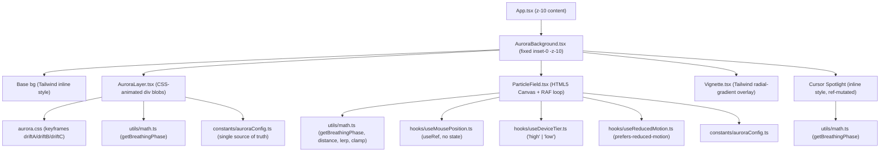

## 1. Architecture Design



## 2. Technology Description

### 2.1 Core Frontend Stack

- React 18.3.1
- TypeScript 5.8.3
- Vite 6.3.5
- Tailwind CSS 3.4.17

### 2.2 Supporting Technologies

- HTML5 Canvas
- CSS Animations
- `requestAnimationFrame`
- Zustand — development controls/state where applicable

### 2.3 Development Tooling

- **ESLint:** 9.25.0
- **TypeScript ESLint:** 8.30.1
- **Vite React Plugin:** 4.4.1
- **React Hooks ESLint Plugin:** 5.2.0
- **React Refresh ESLint Plugin:** 0.4.19
- **PostCSS:** 8.5.3
- **Autoprefixer:** 10.4.21
- **Babel React Dev Locator:** 1.0.6

### 2.4 Rendering Strategy

The Aurora background is implemented as a visual layer behind the portfolio content.

Background elements use:

- `pointer-events-none` so they do not interfere with user interaction
- `aria-hidden="true"` because they are decorative
- React `useRef` for mutable animation state where appropriate
- `requestAnimationFrame` for canvas-based animation
- CSS animations for lightweight aurora movement
- Device-aware rendering to reduce visual workload on lower-powered devices
- `prefers-reduced-motion` support for accessibility

The portfolio UI is rendered above the background using an appropriate stacking context and `z-index`.

### 2.5 Project Configuration

- **Module system:** ES Modules
- **Module resolution:** Bundler
- **JSX transformation:** React JSX
- **TypeScript strict mode:** Disabled
- **Path alias:** `@/*` → `src/*`
- **Build tool:** Vite
- **Source maps:** Hidden source maps for production builds

## 3. Module / File Definitions

### 3.1 Constants

- `src/constants/auroraConfig.ts`
  - `AURORA_COLORS: string[]` — 6 calming blob colors in hex
  - `AURORA_BLOB_COUNT: number` — 6 blobs
  - `AURORA_MIN_SIZE / AURORA_MAX_SIZE: number` — 380–680px
  - `AURORA_BLUR_PX: number` — 90px
  - `AURORA_DRIFT_DURATION_MIN / MAX: number` — 42–72 seconds
  - `AURORA_BASE_OPACITY: number` — 0.38
  - `BREATHING_CYCLE_MS: number` — 8000 (8-second full sine)
  - `BREATHING_DEPTH: number` — 0.25 (± modulation)
  - `PARTICLE_COUNTS: { high: number; low: number }` — 60 / 25
  - `NETWORK_DISTANCE: { high: number; low: number }` — 130 / 90
  - `PARTICLE_BASE_RADIUS: number` — 1.6
  - `PARTICLE_REPULSE_RADIUS: number` — 140
  - `PARTICLE_REPULSE_STRENGTH: number` — 0.9
  - `SPOTLIGHT_RADIUS_PX: number` — 360
  - `SPOTLIGHT_BASE_OPACITY: number` — 0.18
  - `VIGNETTE_STRENGTH: number` — 0.55

### 3.2 Utils

- `src/utils/math.ts`
  - `getBreathingPhase(cycleMs?: number, depth?: number, now?: number): number` — returns `base + sin(t) * depth`, range ~[0.75, 1.25]
  - `dist(x1:number,y1:number,x2:number,y2:number): number` — Euclidean
  - `lerp(a:number,b:number,t:number): number`
  - `clamp(v:number,min:number,max:number): number`
  - `randRange(min:number,max:number): number`

### 3.3 Hooks

- `src/hooks/useReducedMotion.ts` — returns `boolean` via `window.matchMedia('(prefers-reduced-motion: reduce)')`; static subscription
- `src/hooks/useDeviceTier.ts` — returns `'high' | 'low'` based on `innerWidth < 768 || (hardwareConcurrency ?? 8) <= 4`
- `src/hooks/useMousePosition.ts` — returns `{ ref: MutableRefObject<{x:number;y:number}> }`; attaches single `mousemove/touchmove` listener on mount, writes to ref directly (no React state)

### 3.4 Styles

- `src/styles/aurora.css` — global; defines `@keyframes driftA`, `driftB`, `driftC`, `scaleBreath` (translate + scale loops); imported in `main.tsx`

### 3.5 Components

- `src/background/AuroraLayer.tsx`
  - Maps `AURORA_BLOB_COUNT` blobs; each blob = absolute div with:
    - Random initial position (%-based for responsiveness)
    - Size from config range
    - Background color from `AURORA_COLORS` w/ heavy blur (`filter: blur(80px)`)
    - Animation name cycled among driftA/B/C + random duration/delay
    - Opacity sampled from `getBreathingPhase()` * `AURORA_BASE_OPACITY` via a `requestAnimationFrame`-driven style mutation on a container ref (to avoid React re-renders)
  - `pointer-events-none aria-hidden="true"`

- `src/background/ParticleField.tsx`
  - `useRef<HTMLCanvasElement>` + `useRef<Particle[]>` (particles stored imperatively)
  - On mount: `initParticles(count, w, h)` — each particle has `{x, y, vx, vy, baseR, phase}`
  - Single `RAF` loop: if `reducedMotion` → skip motion update but still draw (freeze physics, keep last state)
  - Each frame:
    1. Resize canvas to DPR-corrected size
    2. Clear
    3. Sample `getBreathingPhase()` → `b`
    4. For each particle: brownian drift + cursor repulsion (`dist(mouse, p) < REPULSE_RADIUS` → apply inverse-square velocity away)
    5. Draw particle with alpha = `b * baseAlpha` (brighten near cursor)
    6. N² neighborhood pass: if `dist(p, q) < NETWORK_DISTANCE[tier]` → draw line with alpha inversely proportional to distance
  - Cleanup: cancels RAF

- `src/background/Vignette.tsx`
  - Single div: `pointer-events-none aria-hidden="true" absolute inset-0`
  - Style: `background: radial-gradient(ellipse at center, transparent 0%, transparent 55%, rgba(0,0,0,VIGNETTE_STRENGTH) 100%)`

- `src/background/AuroraBackground.tsx`
  - Orchestrator:
    ```
    <div className="pointer-events-none fixed inset-0 -z-10 overflow-hidden aria-hidden...">
      {/* Base */}
      <div className="absolute inset-0" style={{ background: 'linear-gradient(180deg,#05070d 0%,#0a0f1e 100%)' }} />
      <AuroraLayer />
      <ParticleField />
      {/* Cursor spotlight (inline ref-driven style) */}
      <div ref={spotRef} style={{ background: 'radial-gradient(600px at var(--x) var(--y), rgba(56,189,248,0.10), transparent 60%)' }} />
      <Vignette />
    </div>
    ```
  - Spotlight update: RAF loop writes `--x`/`--y` CSS vars + modulates opacity via `getBreathingPhase()`.

### 3.6 Application Integration

- `src/App.tsx`
  - Provides the application structure and renders the portfolio experience.
  - AuroraBackground is mounted as the global visual background layer.
  - Portfolio content is rendered above the background with an appropriate stacking context.

- Portfolio sections are implemented as reusable React components:
  - Navbar
  - Hero
  - Footer

## 4. Route Definitions

| Route | Purpose |
|-------|---------|
| `/` | Main single-page developer portfolio |

## 5. Data Model

Not applicable (no persistent state, no backend). All mutable state lives in refs and is driven by `Date.now()` / RAF.

## 6. Non-functional Requirements

- **No React re-renders on mousemove**: `useMousePosition` must write only to ref; `ParticleField` and spotlight updater read the ref inside RAF.
- **Reduced motion compliance**: when `useReducedMotion` is true, particle physics updates are skipped (positions frozen), CSS animation-duration is effectively neutral (animation-play-state: paused is applied via class), breathing multiplier is clamped to `1.0`.
- **Device tiering**: low tier halves particle count, reduces network draw distance, shrinks spotlight radius.
- **Accessibility**: all background DOM nodes use `aria-hidden` and `pointer-events-none`; tab navigation unaffected.
